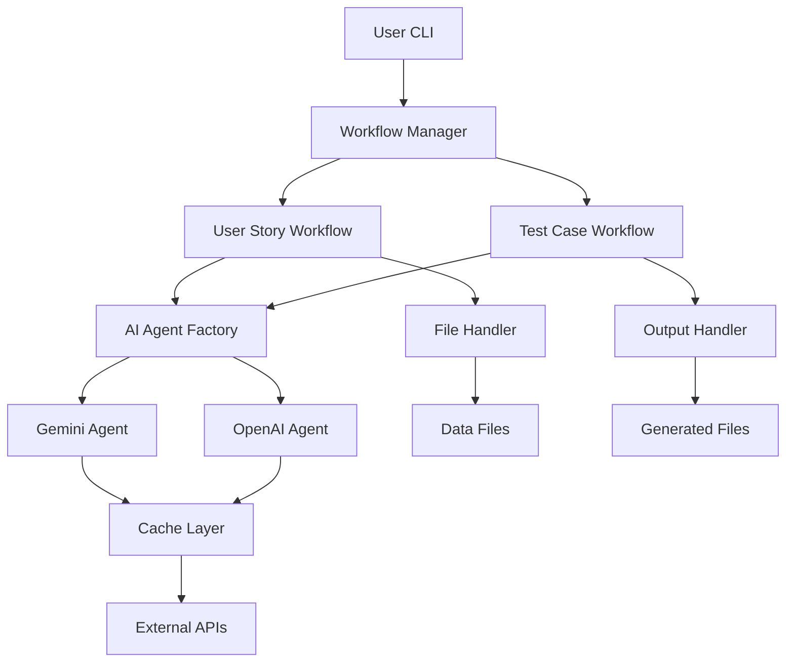

# QA Test Generator 🤖

*AI-powered QA Test Case Generator with bilingual support (English/Spanish), individual test file generation, and interactive workflows*

[](https://www.python.org/downloads/)
[](https://opensource.org/licenses/MIT)
[]()

> **⚠️ DEVELOPMENT STATUS**: This project is under active development. Features and APIs may change.

---

## 📋 Table of Contents

- [🎯 Overview](#-overview)
- [✨ Key Features](#-key-features)
- [🏗️ Architecture](#️-architecture)
- [🚀 Quick Start](#-quick-start)
- [📖 Usage Guide](#-usage-guide)
- [🔧 Configuration](#-configuration)
- [🧪 Testing](#-testing)
- [📁 Project Structure](#-project-structure)
- [🔌 API Reference](#-api-reference)
- [🛠️ Development](#️-development)
- [📊 Performance](#-performance)
- [🔒 Security](#-security)
- [🤝 Contributing](#-contributing)
- [📄 License](#-license)
- [🙏 Acknowledgments](#-acknowledgments)

---

## 🎯 Overview

**QA Test Generator** is a professional command-line application that automates the generation of QA test cases from user stories using artificial intelligence. The system leverages multiple AI providers (Google Gemini and OpenAI) to create comprehensive, bilingual test documentation in SCRUM format, with automatic generation of individual test case files and intelligent formatting for enhanced usability.

### 🎯 Mission
Transform manual QA test case creation into an automated, intelligent process that maintains high quality while supporting both English and Spanish workflows.

### 💡 Vision
Become the standard tool for agile teams seeking to streamline their QA processes through AI-powered automation.

---

## ✨ Key Features

### 🤖 AI-Powered Generation
- **Multi-Provider Support**: Google Gemini 2.5-flash and OpenAI GPT-4
- **Intelligent Analysis**: Deep understanding of user story requirements
- **Context-Aware**: Uses historical examples for consistent output quality

### 🌍 Bilingual Support
- **Complete EN/ES Coverage**: User stories and test cases in both languages
- **Cultural Adaptation**: Localized terminology and expressions
- **Parallel Generation**: Simultaneous bilingual output
- **Gherkin Keyword Preservation**: Maintains English Gherkin keywords (AS A, I WANT TO, etc.) in Spanish test cases for QA standards compliance

### 🔄 Interactive Workflows
- **User Story Workflow**: Generate → Review → Accept/Modify → Regenerate
- **Test Case Workflow**: Analyze → Generate → Review → Accept/Modify → Regenerate
- **Rich CLI Interface**: Beautiful, user-friendly command-line experience

### 🏗️ Enterprise-Ready Architecture
- **Modular Design**: Clean separation of concerns with SOLID principles
- **Versioned Prompts**: Template system with change tracking
- **Comprehensive Logging**: Structured logs with performance metrics
- **Rate Limiting**: Built-in API usage controls and cost management

### 📊 Quality Assurance
- **Automated Validation**: Input/output validation at every step
- **Error Recovery**: Graceful handling of API failures and retries
- **Intelligent Correction**: Automatic fixing of Gherkin keyword translations
- **Caching System**: Intelligent response caching for performance
- **Metrics Collection**: Usage tracking and performance monitoring

### 📁 Advanced Output Management
- **Individual Test Files**: Automatic generation of separate JSON files per test case
- **Structured Organization**: Dedicated `test/` directory for individual test cases
- **Enhanced Formatting**: Line breaks in ACTION fields for better readability
- **Alphanumeric Conversion**: Smart data type conversion for compatibility
- **Flexible File Detection**: Support for .txt files and files without extensions

---

## 🏗️ Architecture

### High-Level Overview



### Core Components

#### 🤖 AI Agents System
- **Base Agent**: Abstract class with retry, rate limiting, and caching decorators
- **Gemini Agent**: Google AI integration with markdown cleaning
- **OpenAI Agent**: GPT-4 integration with optimized prompts
- **Agent Factory**: Dynamic provider selection and instantiation

#### 📝 Prompts System
- **Base Prompt**: Versioned template system with validation
- **User Story Prompt**: Bilingual SCRUM user story generation
- **Test Case Prompt**: Structured test case creation with examples
- **Translation Prompt**: Language conversion utilities

#### 🔄 Workflows System
- **Workflow Manager**: Central orchestrator for complete processes
- **User Story Workflow**: Interactive generation and modification
- **Test Case Workflow**: Test case creation with acceptance loops

#### 🛠️ Utilities
- **Cache**: In-memory caching with TTL for API responses
- **Rate Limiter**: Per-provider rate limiting and cost tracking
- **Metrics**: Performance monitoring and usage analytics
- **File Handler**: Robust file I/O with validation
- **Output Handler**: Multi-format export (CSV, JSON, TXT)

#### 🎨 CLI Interface
- **Rich Interface**: Beautiful terminal UI with colors and formatting
- **Interactive Prompts**: User-friendly confirmation and input systems
- **Progress Display**: Real-time feedback during AI operations

---

## 🚀 Quick Start

### Prerequisites
- Python 3.9+
- API keys for Google Gemini and/or OpenAI

### Installation

1. **Clone the repository**
   ```bash
   git clone <repository-url>
   cd qa-test-generator
   ```

2. **Install dependencies**
   ```bash
   pip install -r requirements.txt
   # OR using poetry
   poetry install
   ```

3. **Configure environment**
   ```bash
   cp .env.example .env
   # Edit .env with your API keys
   ```

4. **Run the application**
   ```bash
   python -m src.main
   ```

### First Run Example

```bash
$ python -m src.main

QA Test Generator - Interactive Mode
====================================

=== USER STORY WORKFLOW ===
Generating User Story...

Generated User Story:
─────────────────────
ENGLISH VERSION
───────────────
HU-01 - Secure User Login

User Story
──────────
As a system user,
I want to securely log in to the system,
So that I can access my account and utilize features that require authentication.

[... continues with acceptance criteria ...]

Do you accept this User Story? (y/N): y

=== TEST CASES WORKFLOW ===
Generating Test Cases...

[... test cases displayed ...]

Do you accept these Test Cases? (y/N): y

QA Test Generation Complete!
Generated files:
  * User Stories: output/run_*/UI-1050_user_story_*.txt
  * Test Cases: output/run_*/UI-1050_test_cases_*.json
  * Individual Tests: output/run_*/test/*.json
```

---

## 📖 Usage Guide

### Interactive Mode (Recommended)

Run the full interactive workflow:
```bash
python -m src.main
```

This provides:
- Step-by-step guidance
- Content preview before acceptance
- Modification opportunities
- Progress feedback
- Automatic generation of individual test case files
- Organized output structure with dedicated test directories

### Programmatic Usage

```python
from src.workflows.workflow_manager import WorkflowManager

# Initialize manager
manager = WorkflowManager()

# Execute complete workflow
context = manager.execute_complete_workflow(
   user_story_path="data/user_story.txt",
   examples_path="data/prompt_examples/prompt_examples.json",
   interactive=False
)

# Check results
if context.state == "completed":
   print("Success!")
   print(f"User Story: {context.final_user_story[:100]}...")
   print(f"Test Cases: {len(context.final_test_cases)} characters")
```

### Individual Components

```python
# Generate user story only
from src.agents.generator_agent import generate_user_story

story = generate_user_story("User needs to login securely")

# Generate test cases only
from src.agents.generator_agent import generate_test_cases
from src.utils.file_handler import load_json_examples

examples = load_json_examples("data/prompt_examples/prompt_examples.json")
test_cases = generate_test_cases(story, examples)
```

---

## 🔧 Configuration

### Environment Variables

Create a `.env` file in the project root:

```bash
# Required: At least one AI provider
GEMINI_API_KEY=your_gemini_api_key_here
OPENAI_API_KEY=your_openai_api_key_here

# Optional: Logging and performance
LOG_LEVEL=INFO
CACHE_TTL_SECONDS=3600

# Optional: Rate limiting (requests per minute)
GEMINI_REQUESTS_PER_MINUTE=60
OPENAI_REQUESTS_PER_MINUTE=60
```

### Configuration Classes

The system uses Pydantic for configuration validation:

```python
from src.config import settings

# Access configuration
print(f"Gemini Model: {settings.gemini_model}")
print(f"Cache TTL: {settings.cache_ttl_seconds}")
print(f"Log Level: {settings.log_level}")
```

### Advanced Configuration

For production deployments, modify `src/config.py`:

```python
class Settings(BaseSettings):
    # Add custom settings here
    custom_setting: str = "default_value"
```

---

## 🧪 Testing

### Test Structure

```
tests/
├── unit/              # Unit tests (isolated components)
├── integration/       # Integration tests (component interaction)
└── e2e/              # End-to-end tests (full workflows)
```

### Running Tests

```bash
# Run all tests
pytest

# Run with coverage
pytest --cov=src --cov-report=html

# Run specific test categories
pytest tests/unit/
pytest tests/integration/
pytest tests/e2e/
```

### Current Test Coverage

- ✅ **Prompts System**: Unit tests for template validation
- ✅ **AI Generation**: Complete unit tests for all generators
- ✅ **Output Handling**: Tests for CSV, JSON, and individual file generation
- ✅ **Workflows**: Full integration tests for workflow management
- ✅ **File Operations**: Comprehensive file handling tests
- ✅ **Data Processing**: Alphanumeric conversion and formatting tests

### Writing Tests

Example unit test:
```python
import pytest
from src.prompts.user_story_prompt import UserStoryPrompt

def test_user_story_prompt_validation():
    prompt = UserStoryPrompt()

    # Valid input
    assert prompt.validate_parameters(description="Valid description")

    # Invalid input
    assert not prompt.validate_parameters(description="")
```

---

## 📁 Project Structure

```
qa-test-generator/
├── src/                          # Source code
│   ├── __init__.py
│   ├── main.py                   # CLI entry point
│   ├── config.py                 # Configuration (Pydantic)
│   ├── logger.py                 # Logging setup (Loguru)
│   ├── agents/                   # AI agents system
│   │   ├── __init__.py
│   │   ├── base_agent.py         # Abstract agent with decorators
│   │   ├── gemini_agent.py       # Google Gemini integration
│   │   ├── openai_agent.py       # OpenAI integration
│   │   ├── agent_factory.py      # Agent instantiation
│   │   └── ai_generator.py       # Legacy generator functions
│   ├── prompts/                  # Prompt template system
│   │   ├── __init__.py
│   │   ├── base_prompt.py        # Versioned template base
│   │   ├── user_story_prompt.py  # User story templates
│   │   ├── test_case_prompt.py   # Test case templates
│   │   └── translation_prompt.py # Translation utilities
│   ├── workflows/                # Workflow orchestration
│   │   ├── __init__.py
│   │   ├── workflow_manager.py   # Central orchestrator
│   │   ├── user_story_workflow.py # User story workflow
│   │   └── test_case_workflow.py # Test case workflow
│   ├── utils/                    # Utility modules
│   │   ├── __init__.py
│   │   ├── cache.py              # Caching system
│   │   ├── rate_limiter.py       # Rate limiting
│   │   ├── metrics.py            # Performance metrics
│   │   ├── file_handler.py       # File operations
│   │   └── output_handler.py     # Export utilities
│   └── cli/                      # Command-line interface
│       ├── __init__.py
│       └── interface.py          # Rich CLI components
├── tests/                        # Test suite
│   ├── __init__.py
│   ├── unit/
│   ├── integration/
│   └── e2e/
├── data/                         # Input data files
│   ├── user_story.txt            # Sample user story
│   ├── UI-915.txt               # Additional user stories
│   ├── LDB-415.txt              # Additional user stories
│   ├── UI-1050.txt              # Additional user stories
│   └── prompt_examples/         # Test case examples directory
│       └── prompt_examples.json # Test case examples
├── output/                       # Generated files
├── logs/                         # Application logs
├── pyproject.toml               # Modern Python configuration
├── requirements.txt             # Dependencies
├── .env                         # Environment variables (gitignored)
├── .env.example                 # Environment template
├── .gitignore                   # Git ignore rules
├── README.md                    # This file
└── architecture.md              # Technical architecture docs
```

---

## 🔌 API Reference

### Core Classes

#### WorkflowManager
```python
class WorkflowManager:
    def execute_complete_workflow(
        self,
        user_story_path: str,
        examples_path: str,
        interactive: bool = True
    ) -> WorkflowContext:
        """Execute complete QA generation workflow."""
```

#### AI Agents
```python
from src.agents import create_agent

# Create agent instance
agent = create_agent("gemini")  # or "openai"

# Generate content
response = agent.generate_response("Your prompt here")
```

#### Prompt Templates
```python
from src.prompts import UserStoryPrompt, TestCasePrompt

# Create prompt instance
user_story_prompt = UserStoryPrompt()

# Render with parameters
prompt_text = user_story_prompt.render(description="User login feature")
```

### Utility Functions

#### File Operations
```python
from src.utils.file_handler import load_json_examples, load_user_story_from_txt
from src.utils.output_handler import (
    save_cases_to_csv, save_user_story_to_files,
    generate_individual_test_files, _format_action_with_line_breaks,
    _to_alphanumeric_string
)

# Load data
examples = load_json_examples("data/prompt_examples/prompt_examples.json")
user_story = load_user_story_from_txt("data/story.txt")

# Save results
save_user_story_to_files(user_story, "output/story.txt")
save_cases_to_csv(test_cases, "output/cases.csv")

# Generate individual test files (NEW)
generate_individual_test_files(test_cases_json, "output/run_dir", "test")

# Format utilities (NEW)
formatted_action = _format_action_with_line_breaks("AS A: user I WANT TO: do something")
alphanumeric_data = _to_alphanumeric_string({"key": "value", "array": [1, 2, 3]})
```

---

## 🛠️ Development

### Development Setup

1. **Install development dependencies**
   ```bash
   poetry install --with dev
   # OR
   pip install -r requirements.txt
   pip install pytest black mypy flake8
   ```

2. **Install pre-commit hooks**
   ```bash
   pre-commit install
   ```

3. **Run development checks**
   ```bash
   # Format code
   black src/ tests/

   # Type checking
   mypy src/

   # Linting
   flake8 src/ tests/

   # Run tests
   pytest
   ```

### Code Quality Standards

- **Formatting**: Black with 100 character line length
- **Type Hints**: Full type annotation with mypy
- **Linting**: flake8 with strict rules
- **Testing**: pytest with >=80% coverage target
- **Documentation**: Google-style docstrings

### Adding New Features

1. **Create feature branch**
   ```bash
   git checkout -b feature/your-feature-name
   ```

2. **Implement with tests**
   ```python
   # Add implementation
   # Add corresponding tests
   # Update documentation
   ```

3. **Run full test suite**
   ```bash
   pytest --cov=src --cov-report=html
   mypy src/
   black src/ tests/
   ```

4. **Submit pull request**

### Architecture Guidelines

- **SOLID Principles**: Single responsibility, open/closed, etc.
- **DRY**: Don't repeat yourself
- **Composition over Inheritance**: Favor composition
- **Explicit over Implicit**: Clear interfaces and contracts
- **Error Handling**: Fail fast with meaningful messages

---

## 📊 Performance

### Current Benchmarks

| Operation | Gemini | OpenAI | Notes |
|-----------|--------|--------|-------|
| User Story Generation | ~20-25s | ~15-20s | Bilingual output |
| Test Case Generation | ~35-40s | ~15-20s | JSON structured |
| Cache Hit | ~0.1s | ~0.1s | Instant response |
| Total Workflow | ~55-65s | ~30-40s | End-to-end |

### Optimization Features

- **Intelligent Caching**: API response caching with TTL
- **Rate Limiting**: Prevents API quota exhaustion
- **Concurrent Processing**: Parallel bilingual generation
- **Memory Management**: Efficient data structures

### Monitoring

Access performance metrics:
```python
from src.utils.metrics import metrics

# View current metrics
print(metrics.get_summary())
```

---

## 🔒 Security

### API Key Management
- Environment variables only (never hardcoded)
- `.env` file gitignored
- Template provided in `.env.example`

### Data Handling
- No sensitive data logging
- Input validation on all user inputs
- Secure file operations with proper permissions

### AI Provider Security
- Official SDK usage only
- No custom API endpoints
- Rate limiting prevents abuse
- Error messages sanitized

### Best Practices
- Regular dependency updates
- Security scanning in CI/CD
- Input sanitization
- Secure logging practices

---

## 🤝 Contributing

We welcome contributions! Please see our [Contributing Guide](CONTRIBUTING.md) for details.

### Development Workflow
1. Fork the repository
2. Create a feature branch
3. Make your changes
4. Add tests
5. Submit a pull request

### Code of Conduct
- Be respectful and inclusive
- Focus on constructive feedback
- Follow our coding standards
- Test your changes thoroughly

---

## 📄 License

This project is licensed under the MIT License - see the [LICENSE](LICENSE) file for details.

```
MIT License

Copyright (c) 2024 QA Test Generator

Permission is hereby granted, free of charge, to any person obtaining a copy
of this software and associated documentation files (the "Software"), to deal
in the Software without restriction, including without limitation the rights
to use, copy, modify, merge, publish, distribute, sublicense, and/or sell
copies of the Software, and to permit persons to whom the Software is
furnished to do so, subject to the following conditions:

[... see LICENSE file for full text ...]
```

---

## 🙏 Acknowledgments

### Technologies Used
- **Python 3.9+**: Core language
- **Pydantic**: Data validation and settings
- **Loguru**: Structured logging
- **Rich**: Beautiful CLI interfaces
- **Google Gemini**: AI generation (Gemini 2.5-flash)
- **OpenAI GPT-4**: AI generation (GPT-4)
- **Poetry**: Dependency management

### Inspiration
- Agile development methodologies
- AI-powered development tools
- Open-source QA automation projects

### Contributors
- **Lead Developer**: [Your Name]
- **Architecture**: Based on SOLID principles and clean architecture
- **Testing**: Comprehensive test suite with multiple layers

---

## 📞 Support

### Getting Help
- **Issues**: [GitHub Issues](https://github.com/your-repo/issues)
- **Discussions**: [GitHub Discussions](https://github.com/your-repo/discussions)
- **Documentation**: See `docs/` directory

### Common Issues

**API Key Configuration**
```bash
# Ensure .env file exists with correct keys
GEMINI_API_KEY=your_key_here
OPENAI_API_KEY=your_key_here
```

**Import Errors**
```bash
# Run from project root
python -m src.main
```

**Performance Issues**
- Check internet connection
- Verify API quotas
- Review rate limiting settings

---

## 🗺️ Roadmap

### ✅ Completed (v1.0.0)
- [x] Bilingual AI generation (EN/ES)
- [x] Interactive CLI workflows
- [x] Multi-provider AI support
- [x] Modular architecture
- [x] Comprehensive testing framework
- [x] Professional logging and metrics
- [x] Individual test case file generation
- [x] Gherkin keyword preservation in Spanish
- [x] Advanced output formatting and organization
- [x] Enhanced file detection and processing

### 🔄 In Development (v1.1.0)
- [ ] Docker containerization
- [ ] CI/CD pipeline
- [ ] Web interface (optional)
- [ ] Additional AI providers
- [ ] Advanced prompt engineering

### 🔮 Future (v2.0.0)
- [ ] Team collaboration features
- [ ] Integration with Jira/Confluence
- [ ] Machine learning optimization
- [ ] Multi-language support beyond EN/ES
- [ ] Enterprise features

---

**🎉 QA Test Generator - Making QA automation intelligent, beautiful, and bilingual!**