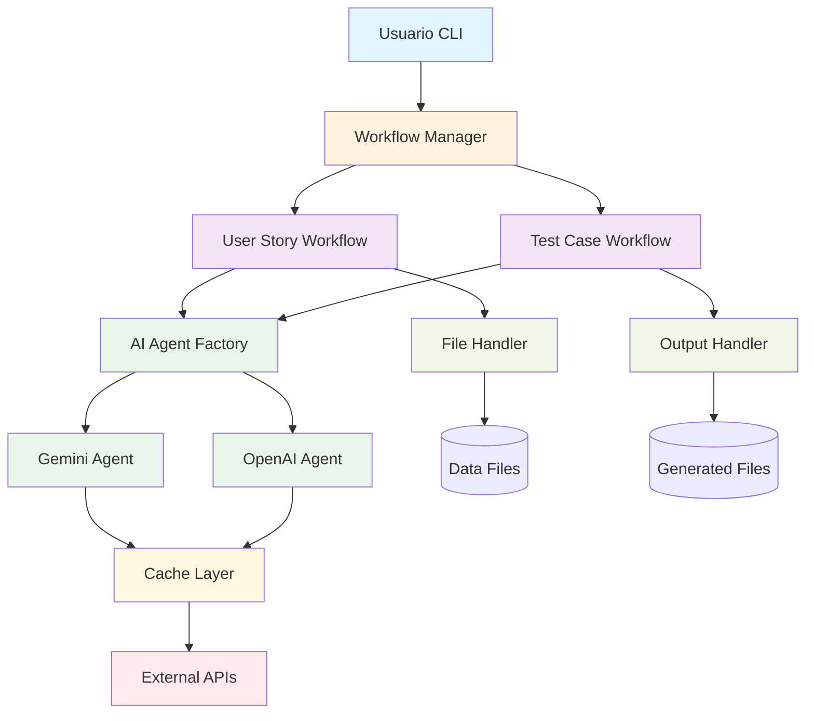

```mermaid
graph TB
    A[Usuario CLI] --> B[Workflow Manager]
    B --> C[User Story Workflow]
    B --> D[Test Case Workflow]
    C --> E[AI Agent Factory]
    D --> E
    E --> F[Gemini Agent]
    E --> G[OpenAI Agent]
    F --> H[Cache Layer]
    G --> H
    H --> I[External APIs]
    C --> J[File Handler]
    D --> K[Output Handler]
    J --> L[(Data Files)]
    K --> M[(Generated Files)]

    style A fill:#e1f5fe
    style B fill:#fff3e0
    style C fill:#f3e5f5
    style D fill:#f3e5f5
    style E fill:#e8f5e8
    style F fill:#e8f5e8
    style G fill:#e8f5e8
    style H fill:#fff8e1
    style I fill:#ffebee
    style J fill:#f1f8e9
    style K fill:#f1f8e9
```