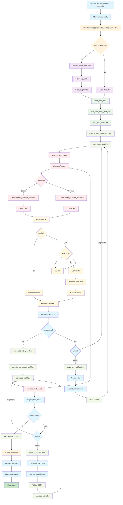

```mermaid
graph TD
    A[Usuario ejecuta python -m src.main] --> B[Mostrar bienvenida]
    B --> C[WorkflowManager.execute_complete_workflow]

    C --> D{Modo Interactivo?}
    D -->|Si| E[perform_initial_selection]
    D -->|No| F[Usar defaults]

    E --> G[select_input_file]
    G --> H[select_ai_provider]
    H --> I[load_input_data]

    F --> I
    I --> J[load_user_story_from_txt]
    J --> K[load_json_examples]

    K --> L[execute_user_story_workflow]
    L --> M[user_story_workflow]

    M --> N[generate_user_story]
    N --> O[AI Agent Factory]
    O --> P{Provider?}
    P -->|Gemini| Q[GeminiAgent.generate_response]
    P -->|OpenAI| R[OpenAIAgent.generate_response]

    Q --> S[Gemini API]
    R --> T[OpenAI API]

    S --> U[Respuesta IA]
    T --> U

    U --> V{Cache?}
    V -->|Si| W[Retornar cache]
    V -->|No| X{Rate limit?}
    X -->|Si| Y[Esperar]
    X -->|No| Z[Llamar API]

    Z --> AA[Procesar respuesta]
    AA --> BB[Guardar cache]
    BB --> CC[Retornar respuesta]

    W --> CC
    Y --> X

    CC --> DD[display_user_story]
    DD --> EE{acceptance?}

    EE -->|Si| FF[save_user_story_to_files]
    EE -->|No| GG{action?}

    GG -->|Regenerar| M
    GG -->|Editar| HH[save_for_modification]
    HH --> II[Usuario edita]
    II --> JJ[wait_for_modification]
    JJ --> KK[Usar editado]
    KK --> M

    FF --> LL[execute_test_cases_workflow]
    LL --> MM[test_case_workflow]

    MM --> NN[generate_test_cases]
    NN --> O

    NN --> OO[display_test_cases]
    OO --> PP{acceptance?}

    PP -->|Si| QQ[save_cases_to_json]
    PP -->|No| RR{action?}

    RR -->|Regenerar| MM
    RR -->|Editar| SS[save_for_modification]
    SS --> TT[Usuario edita JSON]
    TT --> UU[wait_for_modification]
    UU --> VV[Validar JSON]
    VV --> WW[Agregar ejemplos]
    WW --> MM

    QQ --> XX[finalize_workflow]
    XX --> YY[display_success]
    YY --> ZZ[Mostrar archivos]
    ZZ --> AAA[Fin exitoso]

    style A fill:#e1f5fe
    style B fill:#e1f5fe
    style C fill:#fff3e0
    style D fill:#fff3e0
    style E fill:#f3e5f5
    style F fill:#f3e5f5
    style G fill:#f3e5f5
    style H fill:#f3e5f5
    style I fill:#e8f5e8
    style J fill:#e8f5e8
    style K fill:#e8f5e8
    style L fill:#f1f8e9
    style M fill:#f1f8e9
    style N fill:#ffebee
    style O fill:#ffebee
    style P fill:#ffebee
    style Q fill:#ffebee
    style R fill:#ffebee
    style S fill:#ffebee
    style T fill:#ffebee
    style U fill:#fff8e1
    style V fill:#fff8e1
    style W fill:#fff8e1
    style X fill:#fff8e1
    style Y fill:#fff8e1
    style Z fill:#fff8e1
    style AA fill:#fff8e1
    style BB fill:#fff8e1
    style CC fill:#fff8e1
    style DD fill:#e1f5fe
    style EE fill:#e1f5fe
    style FF fill:#f1f8e9
    style GG fill:#e1f5fe
    style HH fill:#f1f8e9
    style II fill:#e1f5fe
    style JJ fill:#e1f5fe
    style KK fill:#f1f8e9
    style LL fill:#f1f8e9
    style MM fill:#f1f8e9
    style NN fill:#ffebee
    style OO fill:#e1f5fe
    style PP fill:#e1f5fe
    style QQ fill:#f1f8e9
    style RR fill:#e1f5fe
    style SS fill:#f1f8e9
    style TT fill:#e1f5fe
    style UU fill:#e1f5fe
    style VV fill:#f1f8e9
    style WW fill:#f1f8e9
    style XX fill:#fff3e0
    style YY fill:#e1f5fe
    style ZZ fill:#e1f5fe
    style AAA fill:#c8e6c9
```