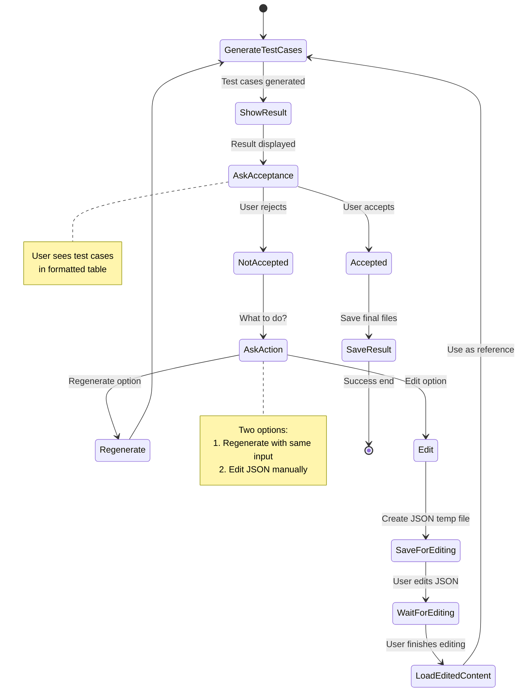

```mermaid
stateDiagram-v2
    [*] --> GenerateTestCases
    GenerateTestCases --> ShowResult: Test cases generated
    ShowResult --> AskAcceptance: Result displayed

    AskAcceptance --> Accepted: User accepts
    AskAcceptance --> NotAccepted: User rejects

    NotAccepted --> AskAction: What to do?

    AskAction --> Regenerate: Regenerate option
    AskAction --> Edit: Edit option

    Regenerate --> GenerateTestCases

    Edit --> SaveForEditing: Create JSON temp file
    SaveForEditing --> WaitForEditing: User edits JSON
    WaitForEditing --> LoadEditedContent: User finishes editing
    LoadEditedContent --> GenerateTestCases: Use as reference

    Accepted --> SaveResult: Save final files
    SaveResult --> [*]: Success end

    note right of AskAcceptance
        User sees test cases
        in formatted table
    end note

    note right of AskAction
        Two options:
        1. Regenerate with same input
        2. Edit JSON manually
    end note
```