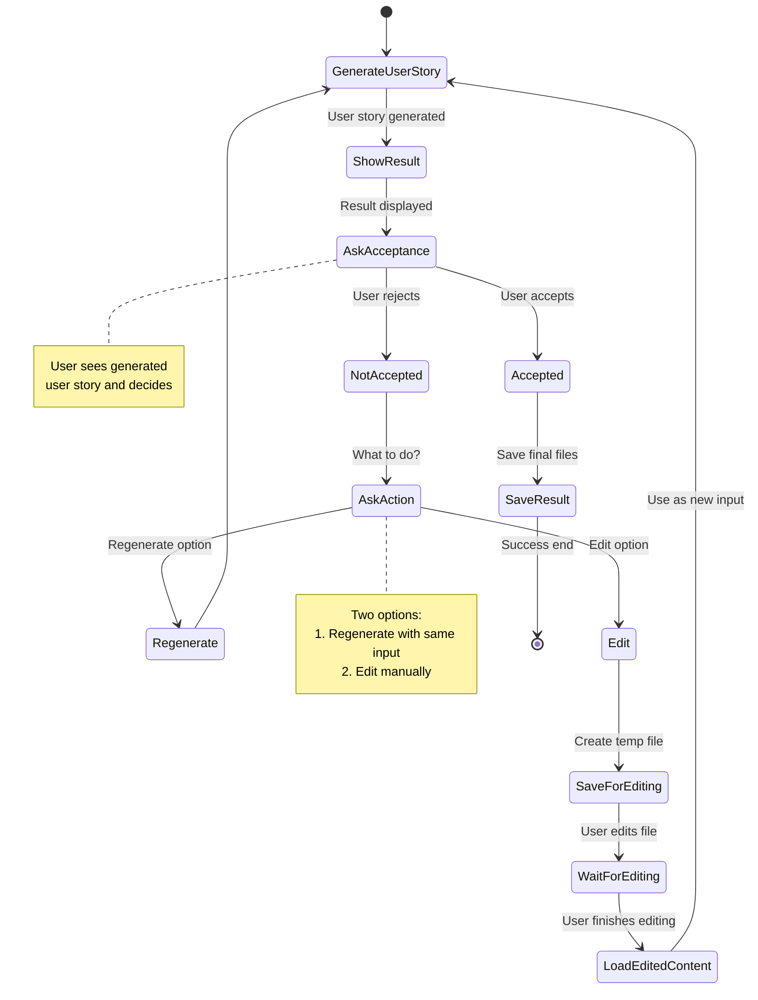

```mermaid
stateDiagram-v2
    [*] --> GenerateUserStory
    GenerateUserStory --> ShowResult: User story generated
    ShowResult --> AskAcceptance: Result displayed

    AskAcceptance --> Accepted: User accepts
    AskAcceptance --> NotAccepted: User rejects

    NotAccepted --> AskAction: What to do?

    AskAction --> Regenerate: Regenerate option
    AskAction --> Edit: Edit option

    Regenerate --> GenerateUserStory

    Edit --> SaveForEditing: Create temp file
    SaveForEditing --> WaitForEditing: User edits file
    WaitForEditing --> LoadEditedContent: User finishes editing
    LoadEditedContent --> GenerateUserStory: Use as new input

    Accepted --> SaveResult: Save final files
    SaveResult --> [*]: Success end

    note right of AskAcceptance
        User sees generated
        user story and decides
    end note

    note right of AskAction
        Two options:
        1. Regenerate with same input
        2. Edit manually
    end note
```