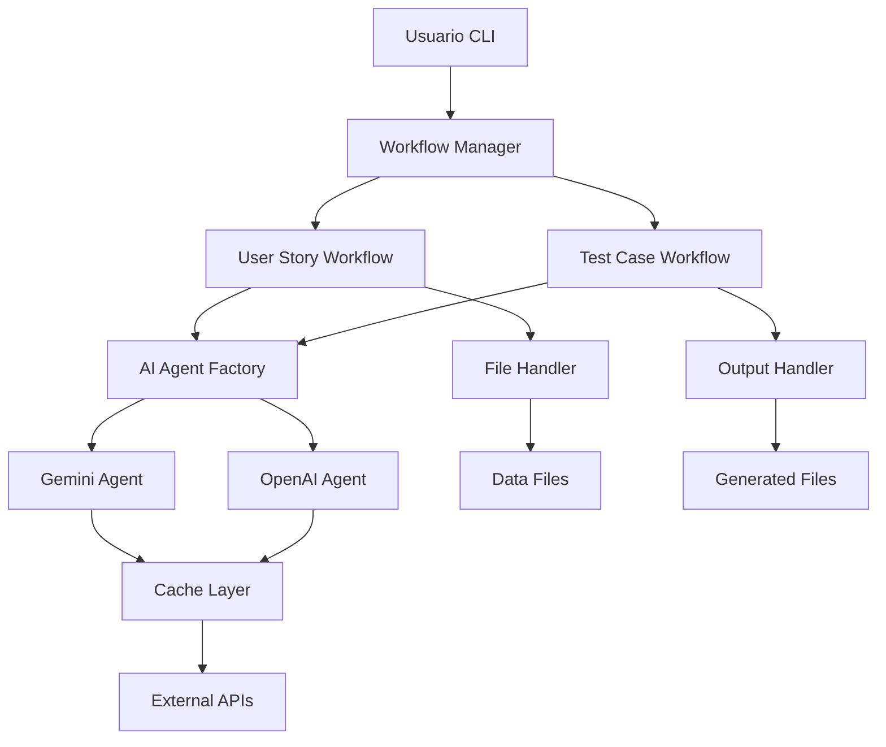

# 📚 Guía Técnica Completa: QA Test Generator

*Documentación detallada del código para desarrolladores junior*

---

## 🎯 Introducción para Desarrolladores Junior

¡Bienvenido! Esta guía te explicará **línea por línea** cómo funciona el **QA Test Generator**. Está diseñada para que incluso si eres nuevo en Python, puedas entender el código completo.

### 🤔 ¿Qué hace este proyecto?

Es una aplicación de línea de comandos que usa **Inteligencia Artificial** para:
- Generar historias de usuario en inglés y español
- Crear casos de prueba automáticamente
- Proporcionar una interfaz interactiva bonita

### 🏗️ Arquitectura General



---

## 📁 Estructura del Proyecto

```
qa-test-generator/
├── src/                          # Código fuente principal
│   ├── main.py                   # 🚀 Punto de entrada
│   ├── config.py                 # ⚙️ Configuraciones
│   ├── logger.py                 # 📝 Sistema de logs
│   ├── agents/                   # 🤖 Integración con IA
│   ├── prompts/                  # 💬 Plantillas de prompts
│   ├── workflows/                # 🔄 Flujos de trabajo
│   ├── utils/                    # 🛠️ Utilidades
│   └── cli/                      # 💻 Interfaz de línea de comandos
├── tests/                        # 🧪 Pruebas
├── data/                         # 📥 Datos de entrada
├── output/                       # 📤 Archivos generados
└── docs/                         # 📚 Documentación
```

---

## 🔧 Configuración y Inicio

### 1. `src/config.py` - El Corazón de la Configuración

```python
from pydantic import Field
from pydantic_settings import BaseSettings
from pathlib import Path
import os

class Settings(BaseSettings):
    """Application settings with validation."""

    # API Keys - ¡Las claves secretas!
    gemini_api_key: str = Field(..., env="GEMINI_API_KEY")  # Requerida
    openai_api_key: str = Field("", env="OPENAI_API_KEY")   # Opcional

    # Rate Limiting - ¡No gastar todo el presupuesto!
    gemini_requests_per_minute: int = Field(60)
    openai_requests_per_minute: int = Field(60)

    # Cache Settings - ¡Guardar tiempo y dinero!
    cache_ttl_seconds: int = Field(3600)  # 1 hora
    cache_backend: str = Field("memory")  # memory o redis

    # Directorios - ¡Dónde guardar cosas!
    base_dir: Path = Field(default_factory=lambda: Path(__file__).parent.parent)
    data_dir: Path = Field(default_factory=lambda: Path(__file__).parent.parent / "data")
    output_dir: Path = Field(default_factory=lambda: Path(__file__).parent.parent / "output")
    logs_dir: Path = Field(default_factory=lambda: Path(__file__).parent.parent / "logs")

    # Logging - ¡Qué tanto ruido hacer!
    log_level: str = Field("INFO")

    # Modelos de IA - ¡Qué cerebro usar!
    gemini_model: str = Field("gemini-2.5-flash")
    openai_model: str = Field("gpt-4")

    class Config:
        env_file = ".env"      # Leer del archivo .env
        case_sensitive = False # No importa mayúsculas/minúsculas

# ¡Una instancia global para usar en todo el proyecto!
settings = Settings()
```

**¿Qué hace esto?**
- **Pydantic** valida que todas las configuraciones sean correctas
- **Variables de entorno** mantienen las claves API seguras
- **Paths automáticos** calculan dónde están los directorios
- **Una sola instancia** `settings` se usa en todo el código

### 2. `src/logger.py` - El Sistema de Logs

```python
from loguru import logger
from .config import settings
import sys

# Configurar el logger con los settings
logger.remove()  # Quitar configuración por defecto
logger.add(
    sys.stdout,  # Mostrar en pantalla
    level=settings.log_level,
    format=settings.log_format
)

# También guardar en archivo
logger.add(
    settings.logs_dir / "qa_test_generator.log",
    rotation="1 day",    # Nuevo archivo cada día
    retention="7 days",  # Mantener 7 días
    level="DEBUG"        # Todo en el archivo
)
```

**¿Por qué es importante?**
- **Loguru** hace logs bonitos y fáciles
- **Diferentes niveles**: DEBUG, INFO, WARNING, ERROR
- **Rotación automática** de archivos
- **Formato coloreado** en terminal

---

## 🤖 Sistema de Agentes de IA

### 1. `src/agents/base_agent.py` - La Base de Todos los Agentes

```python
from abc import ABC, abstractmethod
from typing import Any, Dict, Optional
import time
import hashlib
import json
import logging
from functools import wraps

class AIAgent(ABC):
    """Clase base abstracta para todos los agentes de IA."""

    def __init__(self, provider: str):
        self.provider = provider  # 'gemini' o 'openai'
        self.logger = logging.getLogger(f'qa_test_generator.{self.__class__.__name__}')

    @abstractmethod
    def generate_response(self, prompt: str) -> str:
        """Generar respuesta del modelo de IA."""
        pass

    @abstractmethod
    def validate_response(self, response: str) -> bool:
        """Validar que la respuesta tenga el formato correcto."""
        pass
```

**Patrón de Diseño: Abstract Factory + Template Method**
- **ABC (Abstract Base Class)**: Fuerza a las subclases a implementar métodos
- **Template Method**: Define el esqueleto, las subclases llenan los detalles

### 2. Decoradores Útiles

```python
def retry_on_failure(max_retries: int = 3, delay: float = 1.0):
    """Decorador para reintentar en caso de fallo."""
    def decorator(func):
        @wraps(func)
        def wrapper(*args, **kwargs):
            last_exception = None
            for attempt in range(max_retries):
                try:
                    return func(*args, **kwargs)
                except Exception as e:
                    last_exception = e
                    if attempt < max_retries - 1:
                        sleep_time = delay * (2 ** attempt)  # Backoff exponencial
                        logger.warning(f"Intento {attempt + 1} falló, reintentando en {sleep_time}s: {e}")
                        time.sleep(sleep_time)
                    else:
                        logger.error(f"Todos los {max_retries} intentos fallaron: {e}")
            raise last_exception
        return wrapper
    return decorator
```

**¿Cómo funciona?**
1. Intenta ejecutar la función
2. Si falla, espera cada vez más tiempo (1s, 2s, 4s...)
3. Después de 3 intentos, lanza la excepción original

### 3. `src/agents/gemini_agent.py` - Agente de Google Gemini

```python
import google.generativeai as genai
import time

from .base_agent import AIAgent, retry_on_failure, rate_limited, cached

class GeminiAgent(AIAgent):
    def __init__(self):
        super().__init__("gemini")
        genai.configure(api_key=settings.gemini_api_key)
        self.model = genai.GenerativeModel(settings.gemini_model)

    @retry_on_failure(max_retries=3)
    @rate_limited
    @cached
    def generate_response(self, prompt: str) -> str:
        """Generar respuesta usando Gemini."""
        with record_api_call(self.provider):
            response = self.model.generate_content(prompt)
            return response.text

    def validate_response(self, response: str) -> bool:
        """Validar respuesta - Gemini usualmente da respuestas válidas."""
        return bool(response and response.strip())
```

**Decoradores aplicados:**
- `@retry_on_failure`: Reintenta si falla
- `@rate_limited`: Controla velocidad de llamadas
- `@cached`: Guarda respuestas para no repetir
- `@record_api_call`: Registra métricas

---

## 💬 Sistema de Prompts

### 1. `src/prompts/base_prompt.py` - Plantillas Versionadas

```python
from abc import ABC, abstractmethod
from typing import Dict, Any, Optional
from dataclasses import dataclass
from datetime import datetime

@dataclass
class PromptVersion:
    """Versión de un prompt con metadata."""
    version: str
    created_at: datetime
    description: str
    template: str

class BasePrompt(ABC):
    """Clase base para todas las plantillas de prompts."""

    def __init__(self):
        self.versions: Dict[str, PromptVersion] = {}
        self.current_version = "1.0"
        self._load_versions()

    @abstractmethod
    def _load_versions(self):
        """Cargar todas las versiones disponibles."""
        pass

    def render(self, **kwargs) -> str:
        """Renderizar el prompt con parámetros."""
        template = self.versions[self.current_version].template
        return template.format(**kwargs)

    def validate_parameters(self, **kwargs) -> bool:
        """Validar que los parámetros sean correctos."""
        try:
            self.render(**kwargs)
            return True
        except KeyError:
            return False
```

**¿Por qué versionado?**
- Los prompts de IA cambian con el tiempo
- Diferentes versiones para diferentes casos
- Historial de cambios
- Fácil rollback si algo sale mal

### 2. `src/prompts/user_story_prompt.py` - Prompts para Historias de Usuario

```python
from .base_prompt import BasePrompt, PromptVersion
from datetime import datetime

class UserStoryPrompt(BasePrompt):
    def _load_versions(self):
        """Cargar versiones de prompts para historias de usuario."""
        self.versions["1.0"] = PromptVersion(
            version="1.0",
            created_at=datetime(2024, 1, 1),
            description="Prompt inicial bilingüe",
            template="""
            Generate a user story in SCRUM format for: {description}

            Requirements:
            - Write in both English and Spanish
            - Follow SCRUM format: As a [user], I want [goal], So that [benefit]
            - Include acceptance criteria
            - Make it professional and clear

            ENGLISH VERSION
            ──────────────
            User Story: [English content]

            SPANISH VERSION
            ───────────────
            Historia de Usuario: [Spanish content]
            """
        )
```

---

## 🔄 Flujos de Trabajo (Workflows)

### 1. `src/workflows/workflow_manager.py` - El Director de Orquesta

```python
from enum import Enum
from typing import Optional, Dict, Any
from dataclasses import dataclass

class WorkflowState(Enum):
    """Estados de la ejecución del workflow."""
    INITIALIZED = "initialized"
    USER_STORY_GENERATED = "user_story_generated"
    USER_STORY_ACCEPTED = "user_story_accepted"
    TEST_CASES_GENERATED = "test_cases_generated"
    TEST_CASES_ACCEPTED = "test_cases_accepted"
    COMPLETED = "completed"
    FAILED = "failed"

@dataclass
class WorkflowContext:
    """Objeto contexto que mantiene el estado y datos."""
    state: WorkflowState
    user_story_description: Optional[str] = None
    final_user_story: Optional[str] = None
    final_test_cases: Optional[str] = None
    examples_path: Optional[str] = None
    selected_provider: Optional[str] = None
    selected_input_file: Optional[str] = None
    output_dir: str = "output"
    input_filename: str = ""
    metadata: Dict[str, Any] = None

    def __post_init__(self):
        if self.metadata is None:
            self.metadata = {}
```

**Patrón de Diseño: State + Context Object**
- **State Enum**: Estados claros del proceso
- **Context Object**: Pasa datos entre funciones sin muchos parámetros

### 2. Método Principal: `execute_complete_workflow`

```python
def execute_complete_workflow(
    self,
    interactive: bool = True,
    default_user_story_path: Optional[str] = None,
    default_examples_path: Optional[str] = None,
    base_output_dir: str = "output"
) -> WorkflowContext:

    context = WorkflowContext(state=WorkflowState.INITIALIZED)

    try:
        # Fase 0: Selección inicial (modo interactivo)
        if interactive:
            if not self._perform_initial_selection(context):
                context.state = WorkflowState.FAILED
                return context

            # Crear directorio de ejecución con nombre del archivo
            input_path = Path(context.selected_input_file)
            input_name = input_path.stem
            context.input_filename = input_name

            timestamp = datetime.now().strftime("%Y-%m-%d_%H-%M-%S")
            run_dir = os.path.join(base_output_dir, f"run_{timestamp}_{input_name}")
            os.makedirs(run_dir, exist_ok=True)
            context.output_dir = run_dir

        # Fase 1: Cargar datos de entrada
        if not self._load_input_data(context):
            context.state = WorkflowState.FAILED
            return context

        # Fase 2: Ejecutar Workflow de User Story
        if not self._execute_user_story_workflow(context, interactive):
            context.state = WorkflowState.FAILED
            return context

        # Fase 3: Ejecutar Workflow de Test Cases
        if not self._execute_test_cases_workflow(context, interactive):
            context.state = WorkflowState.FAILED
            return context

        # Fase 4: Finalizar y reportar
        self._finalize_workflow(context)
        context.state = WorkflowState.COMPLETED

        return context

    except Exception as e:
        context.state = WorkflowState.FAILED
        context.metadata['error'] = str(e)
        return context
```

**Flujo paso a paso:**
1. **Inicializar** contexto
2. **Seleccionar** archivo y proveedor (si interactivo)
3. **Crear** directorio único con timestamp + nombre archivo
4. **Cargar** datos de entrada
5. **Generar** user story
6. **Generar** test cases
7. **Guardar** archivos
8. **Reportar** éxito

### 3. `src/workflows/user_story_workflow.py` - Workflow de Historias de Usuario

```python
def user_story_workflow(initial_description: str, provider: str = "gemini", output_dir: str = "output", input_filename: str = "") -> str:
    """Flujo interactivo completo para generación de historias de usuario."""

    logger.info("Starting user story workflow")

    while True:  # 🔄 Loop hasta que el usuario acepte
        # 1. Generar historia de usuario
        cli.display_info("Generating User Story...")
        user_story = generate_user_story(initial_description, provider)

        if not user_story:
            cli.display_error("Failed to generate user story")
            return None

        # 2. Mostrar al usuario
        cli.display_user_story(user_story)

        # 3. Preguntar si acepta
        if cli.ask_user_story_acceptance():
            # ✅ Aceptada - guardar y salir
            cli.display_success("User Story accepted!")
            filename = f"{input_filename}_user_story.txt" if input_filename else "generated_user_story.txt"
            save_user_story_to_files(user_story, os.path.join(output_dir, filename))
            logger.info("User story workflow completed - accepted")
            return user_story
        else:
            # ❌ No aceptada - opciones
            action = cli.ask_user_story_action()

            if action == "regenerate":
                # 🔄 Regenerar con la misma descripción
                cli.display_info("Regenerating User Story...")
                continue  # Volver al inicio del loop
            else:  # "edit"
                # ✏️ Editar manualmente
                cli.display_info("Proceeding to edit User Story...")

                # Guardar para edición
                mod_file = cli.save_for_modification(
                    user_story,
                    os.path.join(output_dir, f"{input_filename}_user_story_for_modification.txt" if input_filename else "user_story_for_modification.txt"),
                    "User Story for modification"
                )

                # Esperar a que el usuario edite
                modified_content = cli.wait_for_modification(mod_file)

                if not modified_content.strip():
                    cli.display_error("No modifications found, keeping original")
                    continue

                # Usar contenido modificado como nueva entrada
                initial_description = modified_content
                cli.display_info("Regenerating User Story with modifications...")
                logger.info("User story modified, regenerating")
```

**Lógica del loop:**
- Genera user story
- Muestra al usuario
- Pregunta: ¿Aceptar?
- **Sí** → Guardar y terminar
- **No** → Preguntar: ¿Regenerar o Editar?
  - **Regenerar** → Loop de nuevo
  - **Editar** → Guardar archivo, esperar edición, usar como nueva entrada

---

## 🛠️ Utilidades

### 1. `src/utils/cache.py` - Sistema de Cache

```python
import hashlib
import json
import time
from typing import Any, Optional, Dict
from abc import ABC, abstractmethod

class Cache(ABC):
    """Clase base abstracta para cache."""

    @abstractmethod
    def get(self, key: str) -> Optional[Any]:
        """Obtener valor del cache."""
        pass

    @abstractmethod
    def set(self, key: str, value: Any, ttl: int = 3600):
        """Guardar valor en cache con TTL."""
        pass

    @abstractmethod
    def clear(self):
        """Limpiar todo el cache."""
        pass

class MemoryCache(Cache):
    """Implementación en memoria del cache."""

    def __init__(self):
        self._cache: Dict[str, Dict[str, Any]] = {}

    def get(self, key: str) -> Optional[Any]:
        """Obtener valor si no expiró."""
        if key in self._cache:
            item = self._cache[key]
            if time.time() < item['expires_at']:
                return item['value']
            else:
                # Expirado, eliminar
                del self._cache[key]
        return None

    def set(self, key: str, value: Any, ttl: int = 3600):
        """Guardar con timestamp de expiración."""
        self._cache[key] = {
            'value': value,
            'expires_at': time.time() + ttl
        }

    def clear(self):
        """Limpiar cache."""
        self._cache.clear()

# Instancia global
cache = MemoryCache()
```

**¿Cómo funciona el cache?**
- **Hash de la key**: `hashlib.md5(prompt.encode()).hexdigest()`
- **TTL (Time To Live)**: Tiempo de vida en segundos
- **Limpieza automática**: Elimina items expirados al acceder

### 2. `src/utils/rate_limiter.py` - Control de Velocidad

```python
import time
from typing import Dict, Optional
from collections import defaultdict

class RateLimiter:
    """Limita la velocidad de llamadas a APIs."""

    def __init__(self, requests_per_minute: int = 60):
        self.requests_per_minute = requests_per_minute
        self.requests: Dict[str, list] = defaultdict(list)

    def can_make_request(self, key: str) -> bool:
        """¿Puede hacer la petición?"""
        now = time.time()
        minute_ago = now - 60

        # Filtrar peticiones de más de 1 minuto
        self.requests[key] = [t for t in self.requests[key] if t > minute_ago]

        # Verificar límite
        return len(self.requests[key]) < self.requests_per_minute

    def record_request(self, key: str):
        """Registrar que se hizo una petición."""
        self.requests[key].append(time.time())

# Instancia global por proveedor
_rate_limiters = {}

def get_rate_limiter(provider: str) -> RateLimiter:
    """Obtener rate limiter para un proveedor."""
    if provider not in _rate_limiters:
        from ..config import settings
        if provider == "gemini":
            rpm = settings.gemini_requests_per_minute
        elif provider == "openai":
            rpm = settings.openai_requests_per_minute
        else:
            rpm = 60
        _rate_limiters[provider] = RateLimiter(rpm)
    return _rate_limiters[provider]
```

**Funcionamiento:**
1. **Ventana deslizante**: Último minuto
2. **Contador por proveedor**: Diferentes límites para Gemini/OpenAI
3. **Limpieza automática**: Elimina timestamps viejos

### 3. `src/utils/output_handler.py` - Manejo de Archivos de Salida

```python
import json
import csv
import uuid
import os
from pathlib import Path

def save_cases_to_json(ai_response_text, output_path):
    """Guardar respuesta JSON de IA."""
    try:
        # Limpiar respuesta (quitar ```json si existe)
        ai_response_text = ai_response_text.strip()
        if ai_response_text.startswith("```json"):
            ai_response_text = ai_response_text[7:]
        if ai_response_text.endswith("```"):
            ai_response_text = ai_response_text[:-3]
        ai_response_text = ai_response_text.strip()

        # Parsear y validar JSON
        data = json.loads(ai_response_text)

        # Guardar con indentación bonita
        with open(output_path, 'w', encoding='utf-8') as f:
            json.dump(data, f, indent=2, ensure_ascii=False)

        print(f"OK - Test cases JSON saved to '{output_path}'")
        return True

    except json.JSONDecodeError as e:
        print(f"ERROR: Invalid JSON: {e}")
        return False
    except Exception as e:
        print(f"ERROR saving JSON: {e}")
        return False

def save_user_story_to_files(user_story_text, base_output_path):
    """Guardar historia de usuario bilingüe."""
    try:
        base_path = Path(base_output_path)

        # Separar versiones inglés/español
        if "SPANISH VERSION" in user_story_text:
            parts = user_story_text.split("SPANISH VERSION")
            english_content = parts[0].strip()
            spanish_content = "SPANISH VERSION" + parts[1].strip()

            # Guardar versión inglés
            english_path = base_path.parent / f"{base_path.stem}_en{base_path.suffix}"
            with open(english_path, 'w', encoding='utf-8') as f:
                f.write(english_content)

            # Guardar versión español
            spanish_path = base_path.parent / f"{base_path.stem}_es{base_path.suffix}"
            with open(spanish_path, 'w', encoding='utf-8') as f:
                f.write(spanish_content)

            return True
        else:
            # Versión única
            with open(base_output_path, 'w', encoding='utf-8') as f:
                f.write(user_story_text)
            return True

    except Exception as e:
        print(f"ERROR saving user story: {e}")
        return False
```

---

## 💻 Interfaz de Línea de Comandos

### 1. `src/cli/interface.py` - CLI Interactiva con Rich

```python
from rich.console import Console
from rich.panel import Panel
from rich.prompt import Prompt, Confirm
from rich.text import Text
from rich.columns import Columns
from rich.table import Table
from rich.markdown import Markdown

class InteractiveCLI:
    """CLI interactiva usando Rich para interfaces bonitas."""

    def __init__(self):
        self.console = Console()

    def display_welcome(self):
        """Mostrar mensaje de bienvenida."""
        welcome_text = Text("QA Test Generator - Interactive Mode", style="bold blue")
        self.console.print(Panel(welcome_text, title="Welcome", border_style="blue"))

    def select_input_file(self) -> Optional[str]:
        """Dejar al usuario seleccionar archivo de entrada."""
        data_dir = settings.data_dir
        txt_files = list(data_dir.glob("*.txt"))

        if not txt_files:
            self.display_error("No .txt files found in data directory")
            return None

        # Mostrar tabla bonita con archivos
        self.console.print("\n[bold cyan]Available Input Files:[/bold cyan]")

        table = Table(show_header=True, header_style="bold cyan")
        table.add_column("Index", style="cyan", width=6)
        table.add_column("Filename", style="white", width=30)
        table.add_column("Size", style="yellow", width=10)
        table.add_column("Modified", style="green", width=20)

        for i, file_path in enumerate(txt_files, 1):
            stat = file_path.stat()
            size_kb = f"{stat.st_size / 1024:.1f} KB"
            modified = datetime.fromtimestamp(stat.st_mtime).strftime("%Y-%m-%d %H:%M")

            table.add_row(str(i), file_path.name, size_kb, modified)

        self.console.print(table)

        # Pedir selección
        while True:
            try:
                choice = Prompt.ask(
                    "\n[bold yellow]Select input file (number or filename)[/bold yellow]",
                    choices=[str(i) for i in range(1, len(txt_files) + 1)] + [f.name for f in txt_files]
                )

                # Manejar selección numérica
                if choice.isdigit():
                    index = int(choice) - 1
                    if 0 <= index < len(txt_files):
                        selected_file = txt_files[index]
                        break
                else:
                    # Manejar selección por nombre
                    for file_path in txt_files:
                        if file_path.name == choice:
                            selected_file = file_path
                            break
                    else:
                        continue
                    break

            except KeyboardInterrupt:
                return None

        self.display_info(f"Selected: {selected_file.name}")
        return str(selected_file)
```

**¿Por qué Rich?**
- **Colores**: Hace la terminal bonita
- **Tablas**: Información organizada
- **Prompts**: Entrada de usuario fácil
- **Panels**: Contenido destacado

---

## 🚀 Punto de Entrada: `src/main.py`

```python
# src/main.py
import os
from datetime import datetime
from src.workflows.workflow_manager import WorkflowManager
from src.cli.interface import cli
from src.logger import logger

# Definir paths
BASE_DIR = os.path.dirname(os.path.dirname(os.path.abspath(__file__)))
DATA_DIR = os.path.join(BASE_DIR, "data")
OUTPUT_DIR = os.path.join(BASE_DIR, "output")

def main():
    """Función principal con workflow interactivo completo."""
    cli.display_welcome()
    logger.info("Starting AI Test Case Generator - Interactive Mode")

    # Asegurar que existe directorio de output
    os.makedirs(OUTPUT_DIR, exist_ok=True)

    # Inicializar Workflow Manager
    workflow_manager = WorkflowManager()

    # Ejecutar workflow completo
    context = workflow_manager.execute_complete_workflow(
        interactive=True,
        base_output_dir=OUTPUT_DIR
    )

    # Verificar estado final
    if context.state.value == "completed":
        logger.info("Interactive workflow completed successfully")
    else:
        logger.error(f"Workflow failed with state: {context.state.value}")
        if 'error' in context.metadata:
            logger.error(f"Error details: {context.metadata['error']}")

if __name__ == "__main__":
    main()
```

**Flujo de ejecución:**
1. **Mostrar bienvenida**
2. **Crear directorios** si no existen
3. **Inicializar** WorkflowManager
4. **Ejecutar** workflow completo
5. **Reportar** resultado

---

## 🔄 Flujo Completo de Datos

```
Usuario ejecuta: python -m src.main
           ↓
    main() muestra bienvenida
           ↓
WorkflowManager.execute_complete_workflow()
           ↓
    _perform_initial_selection()
    ├── cli.select_input_file() → usuario elige archivo
    └── cli.select_ai_provider() → usuario elige Gemini/OpenAI
           ↓
    _load_input_data()
    ├── load_user_story_from_txt() → lee descripción
    └── load_json_examples() → lee ejemplos
           ↓
    _execute_user_story_workflow()
    ├── user_story_workflow() → loop interactivo
    │   ├── generate_user_story() → llama a AI
    │   ├── cli.display_user_story() → muestra resultado
    │   ├── cli.ask_user_story_acceptance() → ¿aceptar?
    │   └── Si NO: cli.ask_user_story_action() → ¿regenerar/editar?
    └── save_user_story_to_files() → guarda EN/ES
           ↓
    _execute_test_cases_workflow()
    ├── execute_test_case_workflow() → loop interactivo
    │   ├── generate_test_cases() → llama a AI
    │   ├── cli.display_test_cases() → muestra resultado
    │   ├── cli.ask_test_cases_acceptance() → ¿aceptar?
    │   └── Si NO: cli.ask_test_cases_action() → ¿regenerar/editar?
    └── save_cases_to_json() → guarda JSON
           ↓
    _finalize_workflow() → muestra resumen
```

---

## 🧪 Sistema de Pruebas

### Estructura de Tests

```
tests/
├── unit/              # Pruebas unitarias (componentes aislados)
│   ├── test_config.py
│   ├── test_prompts.py
│   └── test_output_handler.py
├── integration/       # Pruebas de integración (componentes juntos)
│   └── test_workflow_integration.py
└── e2e/              # Pruebas end-to-end (flujo completo)
    └── test_full_workflow.py
```

### Ejemplo de Test Unitario

```python
# tests/unit/test_output_handler.py
import pytest
import json
import os
import tempfile
from pathlib import Path
from src.utils.output_handler import save_cases_to_csv, save_cases_to_json, save_user_story_to_files

def test_save_cases_to_json_valid():
    """Probar guardar JSON válido."""
    test_data = {
        "english_test_cases": [
            {
                "id": "TEST-001",
                "SUMMARY": "Login test",
                "STEP_1": {
                    "ACTION": "Navigate to login",
                    "INPUT_DATA": "url: /login",
                    "EXPECTED_RESULT": "Login form shown"
                }
            }
        ]
    }

    with tempfile.NamedTemporaryFile(mode='w', suffix='.json', delete=False) as f:
        temp_path = f.name

    try:
        # Ejecutar función
        result = save_cases_to_json(json.dumps(test_data), temp_path)

        # Verificar resultado
        assert result == True

        # Verificar archivo creado
        assert os.path.exists(temp_path)

        # Verificar contenido
        with open(temp_path, 'r') as f:
            saved_data = json.load(f)
        assert saved_data == test_data

    finally:
        # Limpiar
        if os.path.exists(temp_path):
            os.unlink(temp_path)
```

---

## 🎯 Patrones de Diseño Usados

### 1. **Abstract Factory** - Sistema de Agentes
```python
# Base abstracta
class AIAgent(ABC):
    @abstractmethod
    def generate_response(self, prompt: str) -> str: pass

# Implementaciones concretas
class GeminiAgent(AIAgent): ...
class OpenAIAgent(AIAgent): ...

# Factory
class AgentFactory:
    @staticmethod
    def create_agent(provider: str) -> AIAgent:
        if provider == "gemini":
            return GeminiAgent()
        elif provider == "openai":
            return OpenAIAgent()
        else:
            raise ValueError(f"Unknown provider: {provider}")
```

### 2. **Decorator Pattern** - Funcionalidades Transversales
```python
@retry_on_failure(max_retries=3)
@rate_limited
@cached
def generate_response(self, prompt: str) -> str:
    # Lógica principal
    pass
```

### 3. **Strategy Pattern** - Diferentes Estrategias de Cache
```python
class Cache(ABC):
    @abstractmethod
    def get(self, key: str): pass
    @abstractmethod
    def set(self, key: str, value): pass

class MemoryCache(Cache): ...
class RedisCache(Cache): ...
```

### 4. **State Pattern** - Estados del Workflow
```python
class WorkflowState(Enum):
    INITIALIZED = "initialized"
    USER_STORY_GENERATED = "user_story_generated"
    # ... más estados

class WorkflowManager:
    def execute_complete_workflow(self):
        context = WorkflowContext(state=WorkflowState.INITIALIZED)
        # Cambiar estados según progreso
        context.state = WorkflowState.USER_STORY_ACCEPTED
```

### 5. **Template Method** - Workflows Estructurados
```python
class BaseWorkflow(ABC):
    def execute(self):
        self.setup()
        self.process()
        self.cleanup()

    @abstractmethod
    def process(self): pass
```

---

## 🚨 Manejo de Errores

### Estrategias Implementadas

1. **Validación de Entrada**: Pydantic valida configuraciones
2. **Reintentos**: Decorador `@retry_on_failure` para APIs
3. **Rate Limiting**: Evita exceder límites de API
4. **Logging Estructurado**: Seguimiento de errores
5. **Graceful Degradation**: Fallar bien cuando algo sale mal

### Ejemplo de Manejo de Errores

```python
def execute_complete_workflow(self, context):
    try:
        # Operaciones que pueden fallar
        self._perform_initial_selection(context)
        self._load_input_data(context)
        # ...
    except Exception as e:
        # Estado de error
        context.state = WorkflowState.FAILED
        context.metadata['error'] = str(e)
        # Logging
        self.logger.error(f"Workflow failed: {e}")
        return context
```

---

## 📊 Métricas y Monitoreo

### Sistema de Métricas

```python
# src/utils/metrics.py
@dataclass
class MetricsCollector:
    api_calls: Dict[str, int] = field(default_factory=dict)
    errors: Dict[str, int] = field(default_factory=dict)
    response_times: List[float] = field(default_factory=list)

    def record_api_call(self, provider: str, duration: float, success: bool):
        """Registrar llamada a API."""
        self.api_calls[provider] = self.api_calls.get(provider, 0) + 1
        self.response_times.append(duration)
        if not success:
            self.errors[provider] = self.errors.get(provider, 0) + 1
```

### Context Manager para Mediciones

```python
from contextlib import contextmanager

@contextmanager
def record_api_call(provider: str):
    """Context manager para medir llamadas a API."""
    start_time = time.time()
    try:
        yield
        duration = time.time() - start_time
        metrics_collector.record_api_call(provider, duration, success=True)
    except Exception as e:
        duration = time.time() - start_time
        metrics_collector.record_api_call(provider, duration, success=False)
        raise
```

---

## 🎉 Conclusión

Este proyecto demuestra **buenas prácticas de desarrollo**:

- ✅ **Arquitectura modular** con responsabilidades claras
- ✅ **Patrones de diseño** apropiados
- ✅ **Manejo robusto de errores** y reintentos
- ✅ **Configuración flexible** con validación
- ✅ **Testing comprehensive** en múltiples niveles
- ✅ **Documentación detallada** y logging
- ✅ **Interfaz de usuario** amigable
- ✅ **Separación de concerns** (IA, UI, lógica de negocio)

### 🚀 Próximos Pasos para Aprender

1. **Experimenta** modificando el código
2. **Agrega features** como nuevos proveedores de IA
3. **Mejora tests** agregando más cobertura
4. **Optimiza performance** con profiling
5. **Añade features** como web UI o integraciones

### 📚 Recursos de Aprendizaje

- [Pydantic Documentation](https://pydantic-docs.helpmanual.io/)
- [Loguru Logging](https://loguru.readthedocs.io/)
- [Rich CLI](https://rich.readthedocs.io/)
- [Design Patterns](https://refactoring.guru/design-patterns)
- [Clean Architecture](https://blog.cleancoder.com/uncle-bob/2012/08/13/the-clean-architecture.html)

¡Feliz coding! 🎉